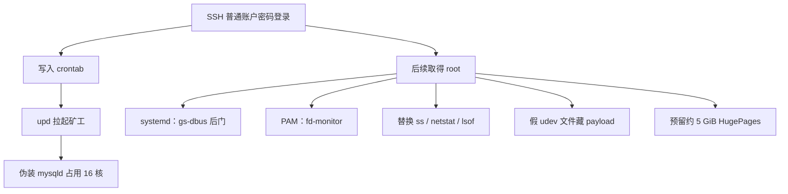

::: important 结论先行
2026 年 8 月 28 日晚，**NPUcraft 实体物理机**遭到 root 级入侵。攻击者部署了伪装成 `mysqld` 的 CPU 挖矿程序，并留下 cron、systemd、PAM 等多处持久化；`ss`、`netstat`、`lsof` 等常用排查工具也被替换。

已发现的恶意组件已在 8 月 29 日清理，完整重启后未再观察到已知 IOC 复活。由于攻击者曾取得 root，在线清理**不能**等同于整机已 100% 可信。
:::

## 📋 基本信息

| 项目 | 内容 |
| --- | --- |
| 时间 | 2026 年 8 月 28 日 21:17 起，至 8 月 29 日 16:07 左右完成重启验证 |
| 对象 | NPUcraft 实体物理机 |
| 硬件 | AMD Ryzen 9 9950X（16 核 32 线程） |
| 性质 | 普通账户 SSH 密码被攻破后，攻击者取得 root，部署矿工与后门 |
| 现状 | 已知恶意组件已清除；完整重启后未见复活 |

NPUcraft 自 2025 年 6 月将实体物理机升级为 9950X。这台机器同时承载游戏服务与管理通道，因此此次入侵不仅是「多了一个高 CPU 进程」，而是主机控制权一度失守。

## 🌐 事件概述

8 月 28 日晚，实体物理机出现非常规律的 CPU 异常：逻辑 CPU 0～15 长时间接近 100%，CPU 16～31 基本空闲，整机负载稳定在约 16。这相当于约一半计算资源被持续占满，会直接挤压同机游戏服务与系统余量。

更反常的是：`top`、`ps`、`pidstat` 里看不到一个能解释约 1600% CPU 占用的进程。继续用 `perf`、`/proc`、cgroup 和软件包完整性检查后，才确认主机已被入侵。

后续排查还原出一套完整的驻留体系：

- 伪装成 `mysqld` 的高 CPU 矿工，启动后删除磁盘上的自身文件
- 普通账户 crontab 每分钟拉起矿工
- `gs-dbus` systemd 后门，进程名伪装成 `[kcached]`
- PAM 注入 `fd-monitor`
- 把矿工副本藏进伪造的 udev 规则文件
- 替换 `ss`、`netstat`、`lsof`，并给恶意文件加上 immutable 属性
- 在系统中预留约 5 GiB HugePages，供矿工使用

因此，这不是「偶然跑起来一个矿工」，而是一次针对主机的 root 级入侵。

## 🔎 异常现象

最初的负载特征非常整齐：

- 前 16 个逻辑 CPU 持续满载
- 后 16 个逻辑 CPU 几乎空闲
- 整机 load 稳定在约 16

9950X 正好有 16 个物理核心。这种「精确吃满一半拓扑」的表现，更像专门绑定了 CPU 的计算任务，而不是普通的游戏卡顿或某个 Java 进程抖动。

::: tip 为什么常规工具一开始看不见
矿工把进程名伪装成 `mysqld`，可执行文件启动后即从 `/tmp` 删除，并且常用网络/进程查看工具后来也被替换。只看 `top` 或 `ss` 的输出，很容易误判为「没有明显异常进程」。
:::

## 🎯 定位矿工进程

常规进程列表无法解释 CPU 占用后，改用内核采样定位真正在消耗周期的线程：

```bash
sudo perf record -a -e cycles:u -g -- sleep 10
```

找到持续占 CPU 的线程后，再核对 `/proc/<TID>/status`、`exe`、`cmdline` 和 `cgroup`，得到：

| 项目 | 观测结果 |
| --- | --- |
| 进程名 | `mysqld` |
| 可执行文件 | `/tmp/mysqld`（已删除） |
| 命令行 | `/tmp/mysqld --tls` |
| 父进程 | PID 1 |
| 线程数 | 38 |
| CPU 绑定 | 多个工作线程分别绑在 CPU 0～15 |

`mysqld` 只是伪装名，并非实体物理机上正常运行的数据库服务。程序启动后会删掉磁盘上的 `/tmp/mysqld`；进程仍在运行时，仍可通过 `/proc/<PID>/exe` 取出样本。

样本 SHA256：

```text
d3fe5445b0ed72113d5bcdcf3681d2923b1c47830dbe3feff883095fc6dc5a19
```

结合 CPU 绑定、大量 HugeTLB 内存和高强度计算行为，该样本高度符合 RandomX 类 CPU 挖矿程序。

## 🪝 持久化与后门

只杀掉矿工没有意义：进程很快再次出现，新实例位于 `cron.service` 对应的 cgroup。继续往下追，才看到完整驻留链。



### crontab 拉起矿工

文中以 **受侵账户** 指代被攻破的普通系统账户，隐去具体用户名。该账户 crontab 中存在：

```cron
* * * * * cd /var/tmp/.ICE-Unix/-bash && ./upd >/dev/null 2>&1
```

攻击链为：

```text
受侵账户 crontab
        ↓
/var/tmp/.ICE-Unix/-bash/upd
        ↓
/tmp/mysqld --tls
```

cron 每分钟都会重新启动矿工，所以「杀进程」只能换来不到一分钟的安静。

### systemd 后门 `gs-dbus`

另外发现名为 `gs-dbus` 的 systemd 服务，实际可执行文件为 `/usr/bin/gs-dbus`，进程名却伪装成 `[kcached]`，看起来像内核线程。

相关环境变量：

```text
GS_PORT=67
GS_ARGS=-k /lib/systemd/system/gs-dbus.dat -ilq
```

该进程存在指向 `51.91.190.241:67` 的外连。

`gs-dbus` 样本 SHA256：

```text
cb5f62bf7b591e69bd38e6bf8e40e8d307d154b2935703422d44f02e403d2e78
```

### PAM 注入

`/etc/pam.d/common-auth` 中被加入：

```text
session optional pam_exec.so quiet /usr/bin/fd-monitor
```

`/usr/bin/fd-monitor` 不属于任何系统软件包。其 SHA256 为：

```text
9762aca7776000b2f523b657a5fb38cf4a286fb964940e2111a871b2feae37b7
```

这意味着登录认证路径也被插入了攻击者的程序。到这一步，实体物理机已经不是「中了一个矿工」，而是完整的 root 级入侵与持久化。

## 🎭 系统排查工具被掉包

这次事件里最需要单独记下的一点：管理员平时最依赖的 `ss`、`netstat`、`lsof` 本身已经被替换。

用软件包完整性校验后，这些文件的校验和异常。它们变成了大约 9 MB 的静态 ELF，而不是正常体积的系统程序。

| 被替换工具 | SHA256 |
| --- | --- |
| `ss` | `ceb8971f12a73940c506f78514fcfba57e253a751d702ebaaf297dc20ca17f2b` |
| `netstat` | `9b824b88100f78658e4d2416d6fb941274b239723beb4c12245198545c04337c` |
| `lsof` | `c7987d90d76f615929c244d9c803d820841178dabc06babe1ebe7b73a3195417` |

攻击者没有直接删掉原版工具，而是改名藏起来：

| 隐藏路径 | 实际情况 |
| --- | --- |
| `/usr/sbin/switch_user` | 被恶意 wrapper 调用的原版程序之一 |
| `/usr/sbin/usb_modeswitch_display` | 与原版 `netstat` 字节级相同 |
| `/usr/bin/tclsh8.5` | 与原版 `lsof` 字节级相同 |
| `/usr/bin/uptimew` | 同类隐藏副本 |

恶意 wrapper 的字符串里直接包含上述隐藏路径。可以据此还原其工作方式：

```text
管理员执行 ss / netstat / lsof
        ↓
恶意 wrapper 接手
        ↓
调用被藏起来的原版工具
        ↓
过滤攻击者自己的进程或连接
        ↓
返回一份「看起来正常」的结果
```

这些恶意替代文件还被设置了 immutable 属性。第一次尝试用官方软件包重装 `iproute2`、`net-tools`、`lsof` 时，包管理器报 `Operation not permitted`。解除 immutable / append 属性后，才从官方软件源恢复正版程序。

::: warning 排查前提
主机一旦被取得 root，本机用户态工具默认不可信。`top` 未必显示真实负载，`ss` 也未必显示真实连接。
:::

## 📦 伪装文件与 HugePages

在 `/usr/lib/udev/rules.d/` 中还发现两个异常文件：

| 路径 | 表面身份 | 实际类型 |
| --- | --- | --- |
| `/usr/lib/udev/rules.d/90-boot.rules` | udev 规则 | ELF 可执行文件，与 `/tmp/mysqld` 样本完全相同 |
| `/usr/lib/udev/rules.d/81-net-ipv6.rules` | udev 规则 | ELF 可执行文件 |

正常 `.rules` 应是文本配置。`90-boot.rules` 的 SHA256 与矿工样本一致，`cmp` 比较也是字节级相同，因此它就是矿工 payload 的另一份副本。

`81-net-ipv6.rules` 的 SHA256：

```text
b074a39f29aa3d7e15b830d2e675faf30c2d12a7527dabd327fa69578a042291
```

此外，`/etc/sysctl.conf` 被加入：

```text
vm.nr_hugepages=2500
```

每个 HugePage 为 2 MiB，攻击者大约预留了：

```text
2500 × 2 MiB ≈ 5 GiB
```

RandomX 类矿工会利用大页降低内存访问开销。清除该配置并重启后：

```text
vm.nr_hugepages = 0
HugePages_Total: 0
Hugetlb: 0 kB
```

HugePages 恢复正常。

## 🚪 入侵入口与时间线

回溯 SSH 日志后，受侵账户在 **2026-08-28 21:17** 左右出现成功的密码登录，随后该账户密码发生变化，约 **21:27** 写入恶意 crontab。

需要强调：受侵账户的 UID 是普通用户，并不是 UID 0。但后续的 `gs-dbus`、`fd-monitor`、矿工、udev payload 和系统工具替换都已经需要 root。因此当前能够确认的只有：

```text
SSH 普通账户密码被攻破
        ↓
攻击者后续取得 root
        ↓
部署矿工、后门和持久化
```

受侵账户到 root 的具体提权路径没有足够证据还原，本文不猜测某个 CVE 或具体漏洞。

| 时间 | 阶段 | 事件 |
| --- | --- | --- |
| 8 月 28 日 21:17 | 入口 | 受侵账户成功 SSH 密码登录 |
| 8 月 28 日 21:27 | 驻留 | 恶意 crontab 被安装 |
| 8 月 29 日 00:06 左右 | 驻留 | 多个恶意文件集中落地 |
| 随后数小时 | 挖矿 | `/tmp/mysqld --tls` 持续占用约 16 个逻辑 CPU |
| 排查阶段 | 发现 | cron、`gs-dbus`、PAM、假 udev 文件 |
| 排查阶段 | 发现 | `ss` / `netstat` / `lsof` 被替换 |
| 清理阶段 | 处置 | 删除持久化，恢复系统软件包，HugePages 清零 |
| 8 月 29 日 16:07 左右 | 验证 | 系统完整重启 |
| 重启后 | 验证 | 未发现已知恶意组件复活 |

## 🧹 处置与验证

处置时先关闭公网 SSH / FRP SSH 暴露，只保留内网管理通道；再保存恶意可执行文件、`/proc` 信息、crontab、systemd unit 和 PAM 配置，然后逐步清理。

主要处理：

1. 删除恶意 crontab
2. 停止并删除 `gs-dbus`
3. 移除 PAM 中的 `fd-monitor`
4. 移除两个假 udev ELF
5. 解除 `ss` / `netstat` / `lsof` 的 immutable 属性
6. 从官方软件源恢复系统工具
7. 删除被藏起来的原版工具副本
8. 清除 HugePages 配置
9. 重新启用 cron
10. 执行完整重启

重启后复查结果：

- CPU 平均 idle 约 99.9%
- 未再出现 `/tmp/mysqld`
- 没有发现 `(deleted)` 可执行文件
- `46.28.65.230` 与 `51.91.190.241` 均无连接
- 已知恶意路径没有重新生成
- cron 只执行正常任务
- HugePages 已清零
- 软件包完整性校验不再报告系统二进制异常

::: tip 当前判断
已经发现的恶意程序和持久化机制已被清除，完整重启后没有观察到它们重新活动。
:::

## 📌 IOC

### 网络

| 地址 | 说明 |
| --- | --- |
| `46.28.65.230:80` | 排查中记录到的网络 IOC |
| `51.91.190.241:67` | `gs-dbus` 外连 |

### 样本

| 角色 | SHA256 | 相关路径 |
| --- | --- | --- |
| 矿工 / `90-boot.rules` | `d3fe5445b0ed72113d5bcdcf3681d2923b1c47830dbe3feff883095fc6dc5a19` | `/tmp/mysqld`、`/usr/lib/udev/rules.d/90-boot.rules` |
| `gs-dbus` | `cb5f62bf7b591e69bd38e6bf8e40e8d307d154b2935703422d44f02e403d2e78` | `/usr/bin/gs-dbus` |
| `fd-monitor` | `9762aca7776000b2f523b657a5fb38cf4a286fb964940e2111a871b2feae37b7` | `/usr/bin/fd-monitor` |
| `81-net-ipv6.rules` | `b074a39f29aa3d7e15b830d2e675faf30c2d12a7527dabd327fa69578a042291` | `/usr/lib/udev/rules.d/81-net-ipv6.rules` |

### 主要路径

```text
/tmp/mysqld
/var/tmp/.ICE-Unix/-bash/upd
/usr/bin/gs-dbus
/usr/bin/fd-monitor
/usr/lib/udev/rules.d/90-boot.rules
/usr/lib/udev/rules.d/81-net-ipv6.rules
```

## 📝 复盘

这次事件最大的教训不是「矿工很耗 CPU」，而是：

> 当 NPUcraft 实体物理机已经被取得 root 时，调查者在本机看到的东西，本身也可能是攻击者希望你看到的东西。

具体表现包括：

- `top` 没有明显给出真实负载来源
- `ss`、`netstat`、`lsof` 都被替换成过滤结果的 wrapper
- `.rules` 文件实际上可以是 ELF 可执行文件
- 恶意文件可通过改 mtime、设置 immutable 来增加排查难度
- 矿工启动后删除自身文件，只靠磁盘扫描会漏掉仍在运行的进程

因此在类似事件中，除了杀进程，还应同时核验 `/proc`、`perf`、cgroup、软件包完整性、文件类型、哈希、文件属性、ctime、cron、systemd、PAM，以及 `/tmp`、`/var/tmp`、`/dev/shm` 这类临时目录。确认 root 失守后，不应再无条件信任本机用户态工具。

::: warning 关于「清理完成」的边界
在线清理无法提供与从可信介质重装相同级别的保证。本文中的「清理完成」仅表示：

**已发现的恶意组件和持久化已经被移除，目前没有观察到它们重新活动。**

这并不等同于：

**已经从理论上证明整台系统 100% 可信。**
:::
